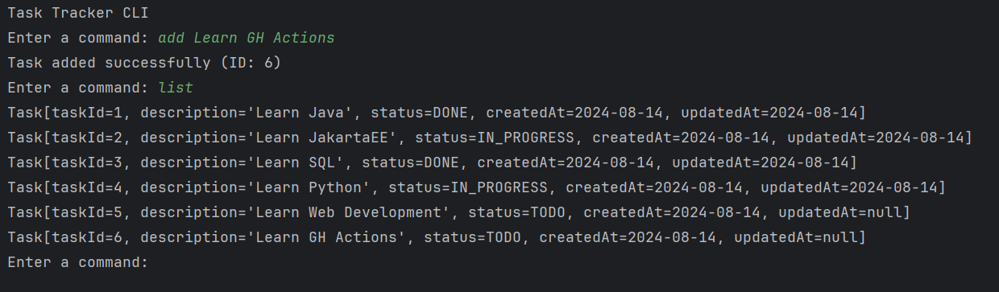
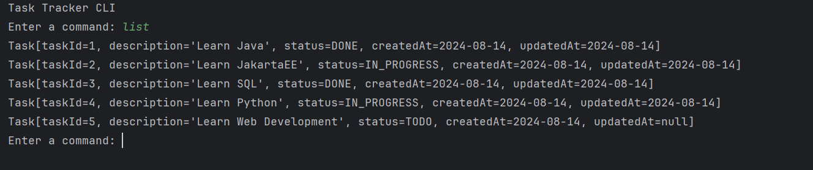
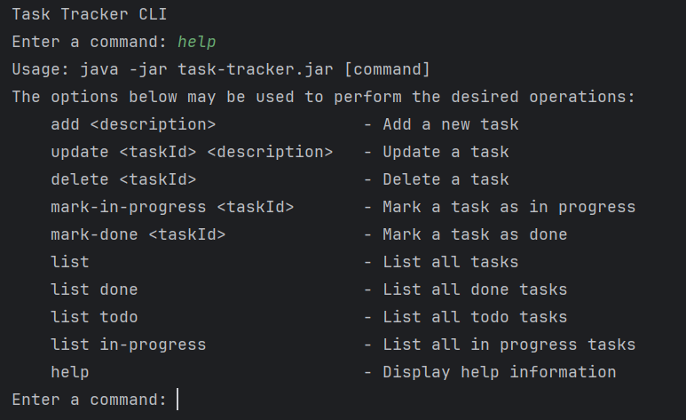

<div align="center">
  <h1 align="center"><a href="https://github.com/ASJordi/task-tracker-cli">Task Tracker CLI</a></h1>

  <p align="center">CLI app to track your tasks and manage your to-do list</p>
</div>

## About :computer:

Task Tracker CLI is a project used to track and manage your tasks. You can add, update and delete tasks, mark a task as in progress or done, and list all tasks, tasks that are done, tasks that are not done, and tasks that are in progress. The tasks are stored in a JSON file in the current directory.

 <br>



## Features :sparkles:

- Add a new task
- Update a task
- Delete a task
- Mark a task as in progress or done
- List all tasks
- List tasks by status (done, todo, in-progress)

## Technologies :gear:

- Java 21
- [Jackson](https://github.com/FasterXML/jackson-databind/)

## Installation :floppy_disk:

1. Clone the repository
2. Open the project in your favorite IDE
3. Run the project
4. Or build the project with Maven and run the generated jar file

```bash
mvn clean install
```

## Usage :hammer_and_wrench:
```bash
Usage: java -jar task-tracker.jar [command]
The options below may be used to perform the desired operations:
    add <description>               - Add a new task
    update <taskId> <description>   - Update a task
    delete <taskId>                 - Delete a task
    mark-in-progress <taskId>       - Mark a task as in progress
    mark-done <taskId>              - Mark a task as done
    list                            - List all tasks
    list done                       - List all done tasks
    list todo                       - List all todo tasks
    list in-progress                - List all in progress tasks
    help                            - Display help information
```

### Examples :bulb:

```bash
# Adding a new task
task-cli add "Buy groceries"
# Output: Task added successfully (ID: 1)

# Updating and deleting tasks
task-cli update 1 "Buy groceries and cook dinner"
task-cli delete 1

# Marking a task as in progress or done
task-cli mark-in-progress 1
task-cli mark-done 1

# Listing all tasks
task-cli list

# Listing tasks by status
task-cli list done
task-cli list todo
task-cli list in-progress
```

## License :page_facing_up:

Distributed under the MIT License. See `LICENSE` for more information.

## Contact :email:

Jordi Ayala - [@ASJordi](https://twitter.com/ASJordi)

Project Link: [https://github.com/ASJordi/task-tracker-cli](https://github.com/ASJordi/task-tracker-cli)

Reference: [https://roadmap.sh/projects/task-tracker](https://roadmap.sh/projects/task-tracker)
